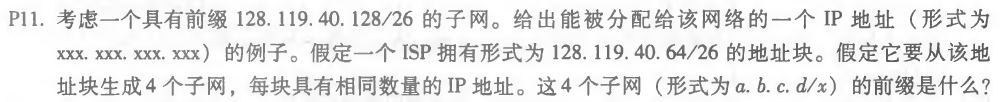
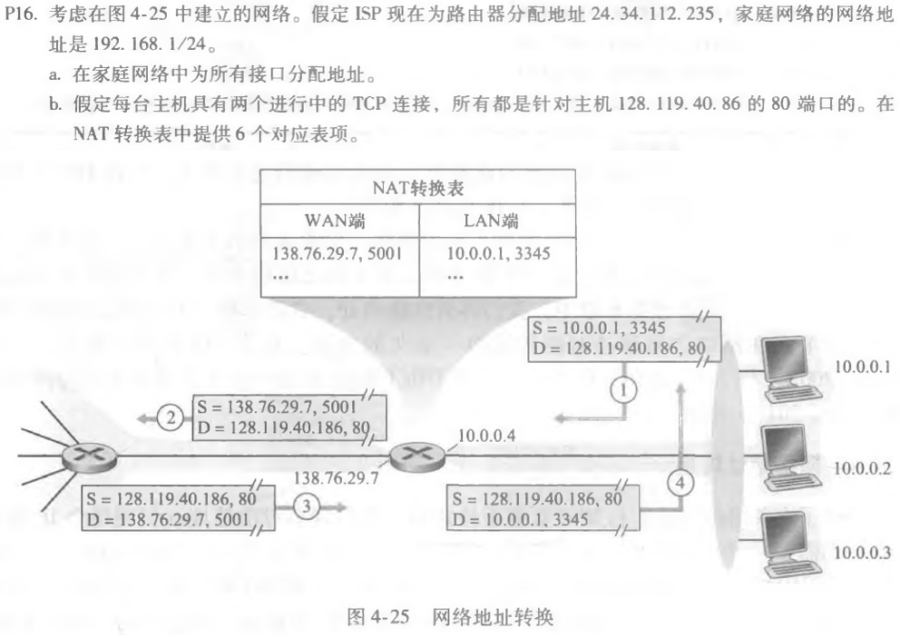

### 第八次作业

* * *

#### P11

##### 题目：

##### 作答：
a.能被分配给该网络的一个IP地址例子：128.119.40.129

（只要在128.119.40.128至128.119.40.191这个范围内的都可以）

b.四个同等大小的子网前缀：

128.119.40.64/28

128.119.40.80/28

128.119.40.96/28

128.119.40.112/28

* * *

#### P15

##### 题目：

##### 作答：
a.假设是用TCP传输的，那么每个TCP段也有20个字节的首部。

所以每个数据报可以携带1500-40=1460字节的数据。

需要的数据报数为：

5000000字节/1460字节 ≈ 3425 （向上取整）

所以需要3425个数据报。

* * *

#### P16

##### 题目：

##### 作答：
a.家庭地址：

192.168.1.1

192.168.1.2

192.168.1.3

路由器接口为 192.168.1.4

b. 

|NAT 转换表 ||
|-|-|
|WAN 侧地址 |LAN 侧地址 |
|24.34.112.235, 4000 |192.168.1.1, 3345 |
|24.34.112.235, 4001 |192.168.1.1, 3346 |
|24.34.112.235, 4002 |192.168.1.2, 3445 |
|24.34.112.235, 4003 |192.168.1.2, 3446 |
|24.34.112.235, 4004 |192.168.1.3, 3545 |
|24.34.112.235, 4005 |192.168.1.3, 3546 |

* * *
