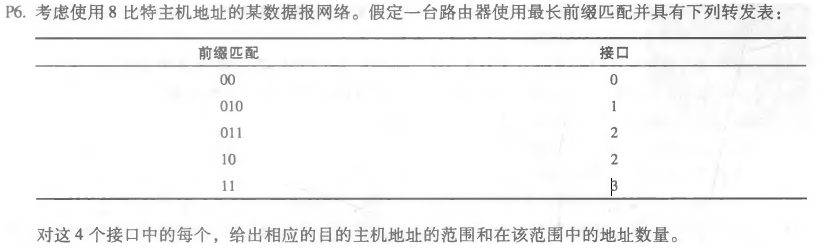
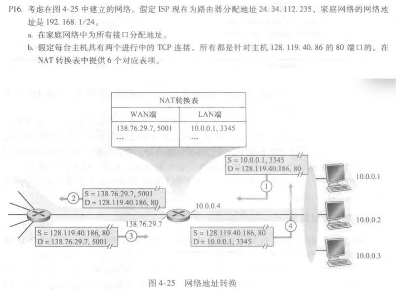

### P6

~~~
范围					数量
00000000-00111111		64
01000000-01011111		32
01100000-10111111		96
11000000-11111111		64
~~~

### P8

~~~
子网1需支持60个接口，由60<64=2^6,32-6=26，得223.1.17.1/26
子网2需支持90个接口，由90<128=2^7,32-7=25，得223.1.17.1/25
子网3需支持12个接口，由12<16=2^4,32-4=28，得223.1.17.1/28
~~~

### P16

~~~
a)
家庭主机 192.168.1.1 192.168.1.2 192.168.1.3
路由器 192.168.1.4

b)
WAN端			   LAN端
24.34.112.235 5001	192.168.1.1 3345
24.34.112.235 5002	192.168.1.1 3346
24.34.112.235 5003	192.168.1.2 3347
24.34.112.235 5004	192.168.1.2 3348
24.34.112.235 5005	192.168.1.3 3349
24.34.112.235 5006	192.168.1.3 3350
~~~

