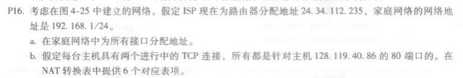

## P11

例子：128.119.40.129

四个子网前缀：128.119.40.64/28、128.119.40.80/28、128.119.40.96/28、128.119.40.112/28.

## P14

每个片段中数据字段的最大大小为680，

所需片段数 = (2400 - 20)/680 = 4(向上取整)。

前三个片段的大小为700个字节(包括IP报头)。

最后一个数据报的大小为360字节(包括IP报头)。

这4个片段的偏移量为0，85, 170, 255。 前三个片段中的每个都有标志=1;最后一个片段将有标志=0。

## P16

a.家庭地址：192.168.1.1 192.168.1.2 192.168.1.3

​	路由接口为192.168.1.4

b.

NAT转换表

| WAN端               | LAN端              |
| ------------------- | ------------------ |
| 24.34.112.235，4000 | 192.168.1.1， 3345 |
| 24.34.112.235，4001 | 192.168.1.1， 3346 |
| 24.34.112.235，4002 | 192.168.1.2， 3445 |
| 24.34.112.235，4003 | 192.168.1.2， 3446 |
| 24.34.112.235，4004 | 192.168.1.3， 3545 |
| 24.34.112.235，4005 | 192.168.1.3， 3546 |

