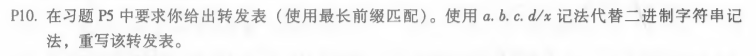
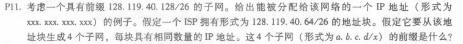
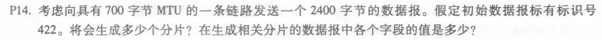

## *第八次作业*

---------------------------------------------  
### 第四章课后习题任选三题  
#### P10  

##### 答：  

|    二进制记法 |   a.b.c.d/x 记法      |  链路接口 | 
| :-------------    |:---------------------| :--------:|
| 11100000 00       | 224.0/10   | 0 |
| 11100000 01000000 | 224.64/16  | 1 |
| 1110000           | 224/8      | 2 |  
| 11100001 1        |225.128/9   | 3 |
| 其他              |其他         | 3 |   
#### P11  

##### 答：  
四个同等大小的子网：  
128.119.40.64/28  
128.119.40.80/28  
128.119.40.96/28  
128.119.40.112/28  
#### P14

##### 答：  
因为有20个字节的IP报头，所以  
需要发送的长度为 2400-20 = 2380 字节，每个片段中数据字段的最大大小为 700-20=680 字节。  
因此需要分片个数为 ⌈2380/480⌉ = 4 。  
前三个分片的大小为700个字节(包括IP报头)，最后一个数据报的大小为360字节(包括IP报头)。
这4个分片的偏移量依次为为0，85，170，255，标志依次为 1，1，1，0。
