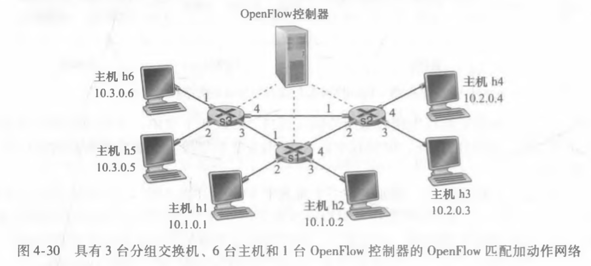

# Homework8

---

## 个人信息

- 班级：软工六班
- 学号：2017302580291
- 姓名：洪龙熙

---

## 作业

### 作业1

- 题目

> P10
>
> 
>
> 在习题P5中要求你给出转发表（使用最长前缀匹配）。使用 a. b. c. d/x 记法代替二进制字符串记法，重写该转发表。

-   答案

    | 目的地址          | a. b. c. d/x | 链路接口 |
    | ----------------- | ------------ | -------- |
    | 11100000 00       | 224.0/10     | 0        |
    | 11000000 01000000 | 224.64/16    | 1        |
    | 1110000           | 224/7        | 2        |
    | 11100001 1        | 225.128/9    | 3        |
    | 其他              | 其他         | 3        |

### 作业2

- 题目

> P16
>
> 考虑在图4-25中建立的网络。
>
> 
>
> 假定ISP现在为路由器分配地址 24.34.112.235，家庭网络的网络地址是 192.168.1/24。
>
> 1.  在家庭网络中为所有接口分配地址。
> 2.  假定每台主机具有两个进行中的 TCP 连接，所有都是针对主机 128.119.40.86 的 80 端口的。在 NAT 转换表中提供 6 个对应表项。 

-   答案

    题意为，图中 138.76.29.7 换为 24.34.112.235，10.0.0/24 换为 192.168.1/24

    1.  主机接口地址：192.168.1.1，192.168.1.2，192.168.1.3

        路由器接口地址：192.168.1.4

    2.  | WAN端               | LAN端             |
        | ------------------- | ----------------- |
        | 24.34.112.235，5001 | 192.168.1.1，3345 |
        | 24.34.112.235，5002 | 192.168.1.1，3346 |
        | 24.34.112.235，5003 | 192.168.1.2，3345 |
        | 24.34.112.235，5004 | 192.168.1.2，3346 |
        | 24.34.112.235，5005 | 192.168.1.3，3345 |
        | 24.34.112.235，5006 | 192.168.1.3，3346 |

        

### 作业3

- 题目

> P19
>
> 考虑显示在图4-30中的 SDN OpenFlow 网络。
>
> 
>
> 假定对于到达 s2 的数据报的期望转发行为如下： 
>
> -   来自主机 h5 或 h6 并且发往主机 h1 或 h2 的任何数据报应当通过输出端口 2 转发到输入端口 1。
> -   来自主机 h1 或 h2 并且发往主机 h5 或 h6 的任何数据报应当通过输出端口 1 转发到输入端口 2。
> -   任何在端口 1 或 2 到达并且发往主机 h3 或 h4 的数据报应当传递到特定的主机。
> -   主机 h3 和 h4 应当能够向彼此发送数据报。 
>
> 详述实现这种转发行为的 s2 中的流表项。 
>
> 对这4个接口中的每个，给出相应的目的主机地址的范围和在该范围中的地址数量。

-   答案

    答案

    | 匹配                                                         | 动作       |
    | ------------------------------------------------------------ | ---------- |
    | Ingress Port = 1; IP Src = 10.3.$*$.$*$; IP Dst = 10.1.$*$.$*$ | Forward(2) |
    | Ingress Port = 2; IP Src = 10.1.$*$.$*$; IP Dst = 10.3.$*$.$*$ | Forward(1) |
    | Ingress Port = 1; IP Dst = 10.2.0.3                          | Forward(3) |
    | Ingress Port = 1; IP Dst = 10.2.0.4                          | Forward(4) |
    | Ingress Port = 2; IP Dst = 10.2.0.3                          | Forward(3) |
    | Ingress Port = 2; IP Dst = 10.2.0.4                          | Forward(4) |
    | Ingress Port = 3                                             | Forward(4) |
    | Ingress Port = 4                                             | Forward(3) |

    

