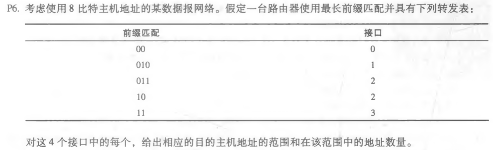

# 第八次作业
## 第四章课后习题任选3题
### P6

#### 答：
!Image(./P6_1.png)

### P8
!Image(./P8)
#### 答：满足这些限制 的网络地址如下：
1. 223.1.17.0/26
2. 223.1.17.128/25
3. 223.1.17.192/28

### P14
!Image(./P14.png)
#### 答：将会生成4个分片，各个字段的值分别如下：
!Image(./P14_1.png)
